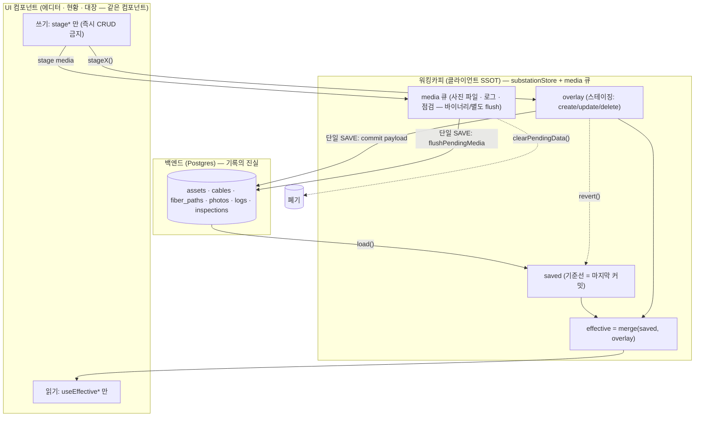

# 워킹카피 아키텍처 — SSOT + git-like (캐논 정의)

> 이 문서는 **변전소 편집 데이터의 단일 진실 공급원(SSOT) + git-like 스테이징** 아키텍처의 캐논 정의다.
> 모든 신규/수정 코드는 여기 정의된 **3대 계약(Read/Write/Commit)**을 지켜야 한다.
> "SSOT를 표방하면서 데이터를 3곳으로 분산 관리"하던 실수(점검·고장이력·케이블·사진 즉시 CRUD 버그)를 구조적으로 차단하는 것이 목적이다.

- 작성일: 2026-06-11
- 상태: 정의(리뷰 대기) → 승인 후 이 문서를 기준으로 리팩토링

---

## 1. 한 줄 요약

> **편집 세션의 모든 변전소 데이터는 하나의 워킹카피에 stage 되고, effective 로만 읽히고, 단일 SAVE 로 커밋되고 단일 되돌리기로 폐기된다. 어떤 컴포넌트도 워킹카피 데이터를 직접 백엔드로 쓰거나(즉시 CRUD) 서버에서 직접 읽지 않는다.**

업계 표준 패턴명: **Local-first / Working-Copy + Staging-and-Commit (git 모델)**, **단방향 데이터 흐름**, **CQRS-lite**(read=effective selector / write=stage command), **Repository**(백엔드 I/O는 commit 계층 한 곳).

---

## 2. 핵심 모델 — git 유추

| git | 이 시스템 | 코드 |
|---|---|---|
| 원격 저장소(origin) | 백엔드 Postgres = **기록의 진실(system of record)** | `POST /substations/:id/commit`, `load()` |
| HEAD(마지막 커밋) | `saved` — 마지막 로드/커밋된 기준선 | `substationStore.saved` |
| staging area(index) + 워킹트리 변경 | `overlay` — 스테이징된 create/update/delete | `substationStore.overlays`, `overlay.ts` |
| 워킹트리(보이는 상태) | `effective = merge(saved, overlay)` | `effectiveAssets/Cables/FiberPaths`, `useEffective*` |
| `git add` | `stageX(create/update/delete)` | `stageAssetUpdate`, `stageCableDelete`, … |
| `git commit` + fetch | 단일 SAVE: commit + media flush + reload | `useCommitWorkingCopy` |
| `git checkout/reset` | 단일 되돌리기 | `WorkingCopyCommitBar.onRevert` → `revert()` + `clearPendingData()` |
| `git status`(dirty 여부) | 단일 dirty 신호 | `useUnifiedDirty` / `getUnifiedDirtyCount` |

**워킹카피 = 편집 세션의 클라이언트 SSOT.** 백엔드는 커밋 시점에만 동기화되는 기록의 진실.

---

## 3. 단일 데이터 흐름 (시각화)



ASCII (터미널용):

```
        ┌───────────────────────────────────────────────┐
        │   백엔드 Postgres — 기록의 진실(system of record) │
        └───────────────▲────────────────────┬───────────┘
            commit(1 SAVE)│  flush(1 SAVE)     │ load()
                          │                    ▼
        ┌───────────────────────────────────────────────┐
        │   워킹카피(클라이언트 SSOT)                       │
        │   saved(기준선) + overlay(스테이징) + media 큐    │
        │                 │                               │
        │   effective = merge(saved, overlay)             │
        └─────▲───────────┬─────────────────────▲─────────┘
       stage*│            │ effective* (읽기)     │ revert() / clearPendingData()
   (쓰기)    │            ▼                       │ (되돌리기 = 폐기)
        ┌───────────────────────────────────────────────┐
        │   UI — 읽기는 effective* 만, 쓰기는 stage* 만     │
        │   (서버 직접 읽기 ✗ · 즉시 CRUD ✗)               │
        └───────────────────────────────────────────────┘
```

---

## 4. 3대 계약 (이 규칙이 버그 클래스를 막는다)

### C1 — Read 계약: "워킹카피 데이터는 effective 로만 읽는다"
- 컴포넌트는 `useEffectiveAssets/useEffectiveCables/useEffectiveFiberPaths/useEffectiveRackModules…` 로 읽는다.
- 서버 쿼리(`useAsset`, `useAssetConnections`, `useNodeAssets` …)는 **effective 미보유(다른 변전소/미로드) 시 폴백**으로만. effective 에 있으면 effective 우선.
- **위반 예(수정함)**: AssetDetailBody 가 `useAsset`(서버)로 읽어 저장 후 stale → 상태 OFF→ON 복귀.
- **위반 예(미수정)**: 케이블 연결 탭이 `useAssetConnections`(서버)로 읽음 → staged 케이블 변경 미반영.

### C2 — Write 계약: "워킹카피 데이터는 stage 로만 쓴다"
- 편집은 `stageAssetUpdate/stageCableDelete/…` 또는 media 큐(`addPendingUpload`, `stagePendingLogDelete`)로만.
- 컴포넌트가 working-copy 엔티티에 `api.post/put/delete` 직접 호출 **금지**.
- **위반 예(수정함)**: 점검·고장이력 즉시 CRUD.
- **위반 예(미수정)**: 케이블 편집/삭제(`useCableMutations`), 사진 삭제(`useDeletePhoto`).
- 강제 장치: working-copy 엔티티엔 직접 CRUD 훅을 **존재시키지 않는다**(읽기 쿼리만). 점검/고장이력에서 이미 적용(mutation 훅 삭제).

### C3 — Commit/Revert/Dirty 계약: "단일 경계"
- **단일 SAVE**: `useCommitWorkingCopy` 가 commit payload(구조 엔티티) + `flushPendingMedia`(미디어)를 한 번에. 그 외 영구화 경로 없음.
- **단일 revert**: `onRevert` 가 `revert()`(오버레이) + `clearPendingData()`(미디어 큐) 모두 폐기.
- **단일 dirty**: `useUnifiedDirty` 가 모든 스테이징(오버레이 + 모든 media 큐)을 합산. 어떤 스테이징도 누락 없이 카운트.
- **불변식**: dirty==0 ⟺ 백엔드에 안 보낸 변경이 0. (즉시 CRUD 가 있으면 이 불변식이 깨진다 → C2로 차단.)

---

## 5. 엔티티 인벤토리 — 무엇이 워킹카피인가

| 엔티티 | 워킹카피? | 쓰기(stage) | 읽기(effective) | 커밋 경로 |
|---|---|---|---|---|
| Asset(설비) | ✅ | `stageAsset*` | `useEffectiveAssets` | substationCommit payload |
| Cable(연결) | ✅ | `stageCable*` | `useEffectiveCables` | substationCommit payload |
| FiberPath(OFD 경로) | ✅ | `stageFiberPath*` | `useEffectiveFiberPaths` | substationCommit payload |
| RackModule(랙 모듈) | ✅(=Asset 자식) | `stageRackModule*` | `useEffectiveRackModules` | substationCommit payload(rackModules) |
| Floor 배경/투명도 | ✅ | `setStagedBackground*` | editorStore 셀렉터 | commit floor 섹션 |
| Photo(사진) | ✅(미디어) | `addPendingUpload` / `pendingPhotoDeletes`* | `useEquipmentPhotos`+큐 머지 | flushPendingMedia |
| MaintenanceLog(고장이력) | ✅(미디어형) | `pendingLogs(+deletes)` | `useMaintenanceLogs`+큐 머지 | flushPendingMedia |
| InspectionLog(점검) | ✅(미디어형) | `pendingInspections(+deletes)` | `useInspectionLogs`+큐 머지 | flushPendingMedia |
| — | | | | |
| RackPreset(프리셋) | ❌ 조직 레벨 | 직접 CRUD 허용 | 서버 쿼리 | 즉시 |
| 노드 대장 Asset(useSubstationAssets) | ❌ 별도 스코프 | 직접 CRUD 허용 | 서버 쿼리 | 즉시 |
| 인증/사용자/카테고리 | ❌ | 직접 CRUD 허용 | 서버 쿼리 | 즉시 |

> **이상(理想)**: 미디어형(사진/로그/점검)도 구조 오버레이로 흡수해 commit payload 한 줄기로 — 단 사진은 바이너리(File)라 별도 큐가 합리적. 그래서 현재는 **두 메커니즘(구조 오버레이 + 미디어 큐)이되 C3(단일 commit/revert/dirty) 계약을 공유**하는 것을 표준으로 한다. logs/inspections 를 substationCommit payload 로 흡수하는 것은 백엔드 커밋 확장이 필요 — P3+ 선택.

---

## 6. 필드 SSOT (변환기/커밋의 드롭 방지 규칙)

- 한 엔티티의 필드 집합은 **레이어당 한 곳**에서만 정의(프론트 공통 상수 / 백엔드 헬퍼 / Zod 공통 객체). asset↔rackModule 처럼 같은 행을 다루는 경로는 같은 정의를 공유. (커밋 경로 통합으로 적용됨 — `883735d`.)
- 변환기는 **allowlist 금지, passthrough+rename** 우선. 새 필드 추가 시 한 곳만 고쳐도 안 빠지게. (toRackModulePatch 적용됨.)
- 같은 로직은 단일 모듈: `isRackModule`, `statusIsOn`, `assetPatchToListItem`, `computeLastMaintenanceDate` 등은 각각 한 곳에서 export 후 임포트.

---

## 7. 현재 위반(갭 분석) — 전수조사 결과(검증됨)

| # | 위반 | 계약 | 상태 |
|---|---|---|---|
| 1 | 점검·고장이력 즉시 CRUD | C2 | ✅ 수정됨 |
| 2 | AssetDetailBody 서버 읽기 | C1 | ✅ 수정됨(effective 우선) |
| 3 | 랙모듈 status/description 등 커밋 드롭 | 필드SSOT | ✅ 수정됨(커밋 통합) |
| 4 | **케이블 연결 탭: 서버 읽기 + 즉시 CRUD** | C1·C2 | ❌ 미수정(활성) |
| 5 | **사진 삭제 즉시 CRUD** (업로드는 staged) | C2·C3 | ❌ 미수정(활성) |
| 6 | dirty/revert 가 케이블/사진삭제 직접변경 미반영 | C3 | ❌ (4·5 해결 시 동반 해결) |
| 7 | 죽은 즉시-CRUD 훅(useCreateFiberPath/useDeleteFiberPath, useAssetPhotos, useAssetMaintenanceLogs) | C2 위생 | ❌ 제거 대상 |
| 8 | 로직 중복(isRackModule·statusIsOn·assetPatchToListItem·lastMaintenanceDate) | 필드SSOT | ❌ 단일화 대상 |
| 9 | 모델 이중성 FloorPlanEquipment↔Asset(변환기 4개) | 구조 | ❌ P3(C) |
| 10 | 중복 CableDetailDTO 정의 | 구조 | ❌ 정리 대상 |

---

## 8. 리팩토링 계획 (이 아키텍처를 기준으로)

각 단계: front/back `tsc` 0 + `vitest` + **실측**(staged→effective 반영 / commit→DB / revert→폐기) + 회귀 테스트 + 단계 커밋.

- **P1 — C2/C1 위반 제거(활성 버그)**
  - 케이블 연결 탭: `useEffectiveCables`+effective assets 로 연결 목록 구성(읽기), 편집/삭제는 `stageCableUpdate/Delete`(쓰기). 즉시 `useCableMutations` 제거.
  - 사진 삭제: `pendingPhotoDeletes` 신설 → flush(DELETE)/dirty/revert/UI 배선.
  - 죽은 즉시-CRUD 훅 제거(#7).
- **P2 — 필드SSOT 단일화(드리프트 제거)**: #8 로직 단일 모듈화 + #10 DTO 정리.
- **P3 — 모델 이중성 붕괴(C)**: FloorPlanEquipment 필드명→Asset 정렬 → 변환기 항등화 → 삭제 → 타입 제거. (회귀 위험 큼 — 별도 세부 plan.)
- **P4 — 위생**: deprecated 잔재(`today` prop 등), 스냅샷 path 중복 컴포넌트 검토.

P1·P2 는 활성 버그 + 저위험 고효용 → 먼저. P3 는 큰 회귀 위험 → 마지막, 세부 plan 별도.

---

## 9. 가드레일 (회귀 방지 — "다시는 안 하게")

1. **working-copy 엔티티엔 직접 CRUD 훅을 만들지 않는다** — 읽기 쿼리만. (점검/고장이력처럼 mutation 훅 부재 = 우회 불가.)
2. **컴포넌트는 working-copy 데이터를 effective 로 읽는다** — 서버 쿼리는 폴백 주석을 단다.
3. **새 필드는 레이어당 한 곳**(공통 상수/헬퍼/Zod 객체)에만 추가.
4. 새 working-copy 엔티티는 §5 인벤토리에 등록하고 C1/C2/C3 계약을 구현(stage·effective·commit·revert·dirty)했는지 체크.
5. (선택) lint 룰: `features/**` 컴포넌트에서 working-copy 엔드포인트(`/assets`,`/cables`,`/fiber-paths`,`/equipment-photos`,…)로의 `api.post/put/delete` 금지.
